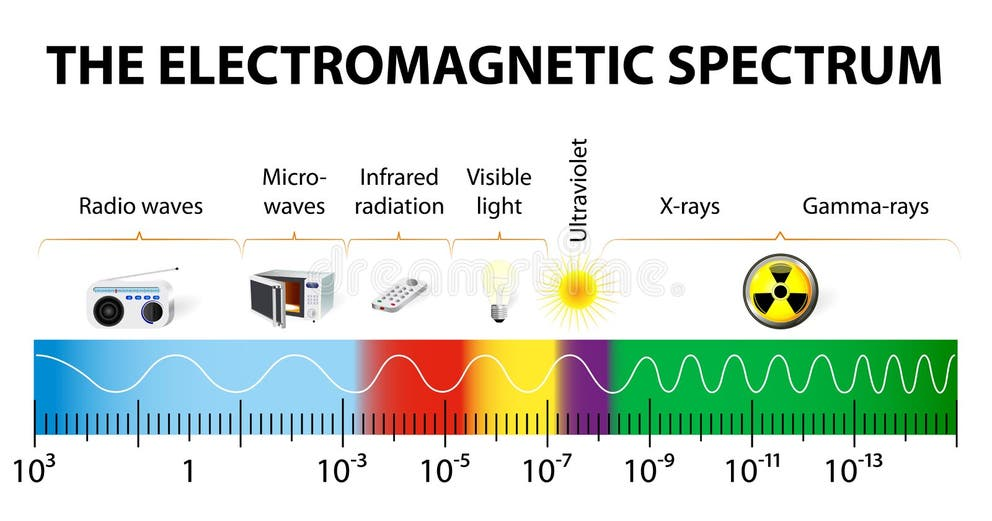

:author: Varun Kapoor
:email: varun.kapoor@kaporlabs.org
:institution: KapoorLabs, Paris, France.

:bibliography: vkc

------------------------------------------------------------------------------------------------
Title of the document
------------------------------------------------------------------------------------------------

.. class:: abstract

.. class:: keywords

Writing Equations
-----------------

This is how we can type labelled equations 

.. math::
   :label: eq-schrodinger-stationary

   \hat{H} \psi(\mathbf{r}) = E \psi(\mathbf{r})

For writing simple math stuff without numbering we can use 

:math:`GT = \{gt\}`, :math:`SEG=\{seg\}` are two sets of segmented objects.

Writing Code
-------------

For writing code we can do it like this

.. code-block:: python     

  def WatershedwithMask3D(Image, Label, mask, grid):
    properties = measure.regionprops(Label, Image) 
    binaryproperties = 
    measure.regionprops(label(mask), Image) 
    Coordinates = [prop.centroid for prop in properties] 
    BinaryCoordinates = [prop.centroid for 
    prop in binaryproperties]
    Binarybbox =
    [prop.bbox for prop in binaryproperties]
    Coordinates = sorted(Coordinates , 
    key=lambda k: [k[0], k[1], k[2]]) 

    if len(Binarybbox) > 0:    
         for i in range(0, len(Binarybbox)):
        
            box = Binarybbox[i]
            inside = [iou3D(box, star) 
            for star in Coordinates]

            if not any(inside) :
                  Coordinates.append(BinaryCoordinates[i])    
         

    Coordinates.append((0,0,0))
    Coordinates = np.asarray(Coordinates)
    coordinates_int = np.round(Coordinates).astype(int) 

    markers_raw = np.zeros_like(Image) 
    markers_raw[tuple(coordinates_int.T)] = 1
    + np.arange(len(Coordinates)) 
    markers = morphology.dilation(
    markers_raw.astype('uint16'), morphology.ball(2))

    watershedImage = watershed(-Image, markers, 
    mask = mask.copy()) 
    return watershedImage, markers
      

Putting a figure
------------------

For adding a figure it is like 

   Schematic representation showing the radiation spectrum with decreasing wavelength (in meters) from left to right, radio waves have wavelength of kilometers (that is what it needs to be in our houses from a transmitter tower), microwaves of about 5 cm (easy guess as the size of the box itself is about 15 cm or so) while the visible radiation is 400-800 nano meter.

Then we can refer to the figure by saying is shown in the Figure :ref:`radiation`

Citing People
--------------

:cite:`schmidt2018` :cite:`weigert2020` :cite:`Beucher2018` :cite:`Ronn2015` :cite:`Wolny2020` :cite:`eschweiler2018`

References
---------------------
